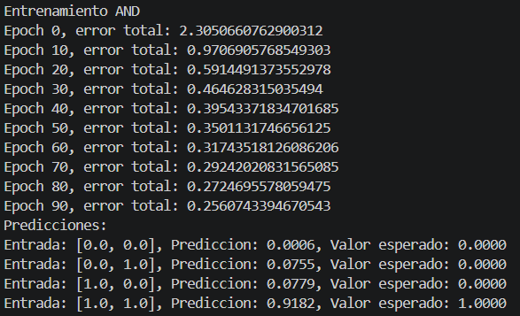
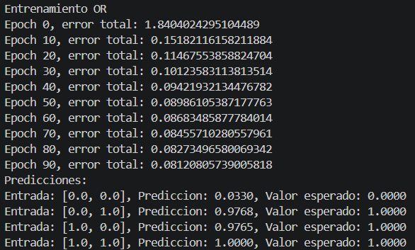
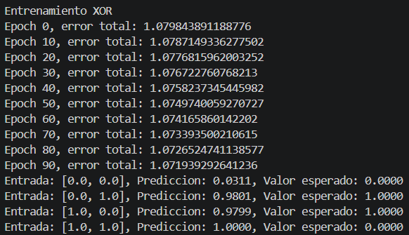
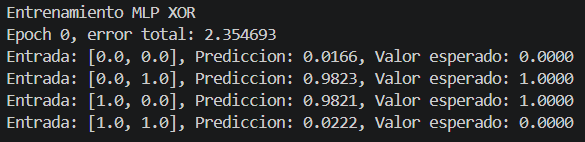

# Multilayer-Perceptron

Este repositorio contiene la implementación de un Perceptrón Multicapa (Multilayer Perceptron, MLP) desarrollado como parte de la asignatura de Inteligencia Artificial. El objetivo del proyecto es diseñar, entrenar y evaluar una red neuronal feedforward para tareas de clasificación y regresión, aplicando técnicas de optimización, regularización y validación.

## Sección de imágenes de los entrenamientos

A continuación puedes añadir las imágenes de los entrenamientos para el problema del AND, OR y XOR.

### Entrenamiento AND

### Entrenamiento OR

### Entrenamiento XOR
En este entrenamiento el error total en cada epoca no reduce significativamente por lo que no va a converger

### Entrenamiento XOR en una MLP

# Multilayer-Perceptron

